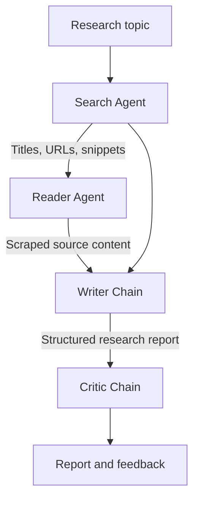

# ResearchMind - Multi-Agent Research System

ResearchMind is an AI-powered research assistant that coordinates specialized LangChain components to search the web, inspect relevant sources, write a structured report, and critique the final output. It provides both an interactive Streamlit interface and a reusable Python research pipeline.

## Features

- Searches for recent information using the Tavily Search API
- Selects and scrapes a relevant source for deeper context
- Produces structured reports with introductions, key findings, conclusions, and sources
- Evaluates each report with a dedicated critic chain and assigns a score out of 10
- Displays intermediate results and pipeline progress in a custom Streamlit interface
- Exports the generated report as a Markdown file

## System Architecture



## Pipeline

1. **Search Agent** queries Tavily and returns five recent results with titles, URLs, and summaries.
2. **Reader Agent** identifies a relevant result and uses the scraping tool to extract its main text.
3. **Writer Chain** combines the search results and detailed content into a professional research report.
4. **Critic Chain** scores the report, identifies strengths and weaknesses, and provides a concise verdict.

## Tech Stack

| Component | Technology |
|---|---|
| Language model | OpenAI GPT-4o mini |
| Agent framework | LangChain |
| Web search | Tavily Search API |
| Web extraction | Requests and Beautiful Soup |
| Interface | Streamlit |
| Environment management | python-dotenv |
| Language | Python |

## Project Structure

```text
Multi-Agent-Research-System/
├── app.py              # Streamlit interface and pipeline execution
├── agents.py           # Search/reader agents and writer/critic chains
├── tools.py            # Tavily search and webpage scraping tools
├── requirements.txt    # Python dependencies
├── .env.example        # Environment-variable template
├── .gitignore          # Files excluded from version control
└── README.md
```

## Getting Started

### 1. Clone the repository

```bash
git clone https://github.com/dhruv2907s/Multi-Agent-Research-System.git
cd Multi-Agent-Research-System
```

### 2. Create and activate a virtual environment

On macOS or Linux:

```bash
python3 -m venv .venv
source .venv/bin/activate
```

On Windows:

```bash
python -m venv .venv
.venv\Scripts\activate
```

### 3. Install dependencies

```bash
pip install -r requirements.txt
```

### 4. Configure API keys

Create a local `.env` file in the project root:

```env
OPENAI_API_KEY=your_openai_api_key
TAVILY_API_KEY=your_tavily_api_key
```

Never commit the `.env` file. Ensure `.gitignore` contains:

```gitignore
.env
.venv/
__pycache__/
*.pyc
.DS_Store
```

### 5. Start the application

```bash
streamlit run app.py
```

The application will open in your browser, normally at `http://localhost:8501`.

## Usage

1. Enter a research topic, such as `Recent advances in fusion energy`.
2. Select **Run Research Pipeline**.
3. Follow the search, reading, writing, and critique stages in the interface.
4. Review the final report and critic feedback.
5. Download the report as a Markdown file if required.

## Example Output

The generated report follows this structure:

```text
Introduction

Key Findings
- Finding 1
- Finding 2
- Finding 3

Conclusion

Sources
- Source URLs
```

The critic returns:

```text
Score: X/10

Strengths:
- ...

Areas to Improve:
- ...

One-line verdict:
...
```

## Current Limitations

- Some websites block automated scraping or render content through JavaScript.
- The reader currently analyzes one selected source in depth.
- Generated reports should be verified against their cited sources before use.
- Output quality depends on search-result quality and source accessibility.

## Future Improvements

- Read and compare multiple sources before report generation
- Add citation validation and duplicate-source filtering
- Introduce iterative revision based on critic feedback
- Support PDF and academic-paper ingestion
- Add report history and export formats such as PDF and DOCX

## Disclaimer

ResearchMind is intended for educational and research assistance. Generated content may contain inaccuracies and should not replace independent source verification.

## Author

**Dhruv Shah**

- [GitHub](https://github.com/dhruv2907s)
